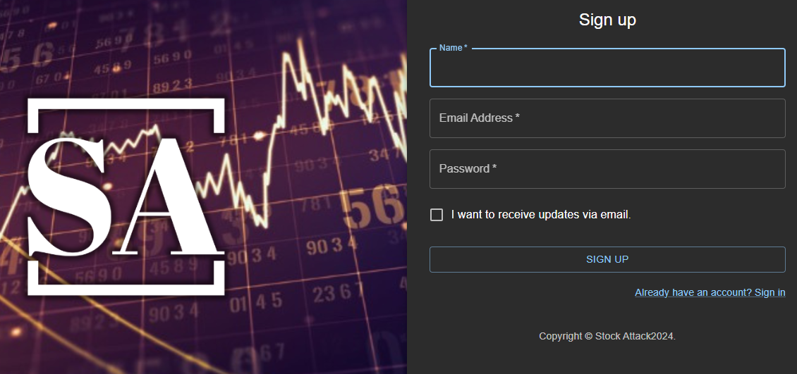
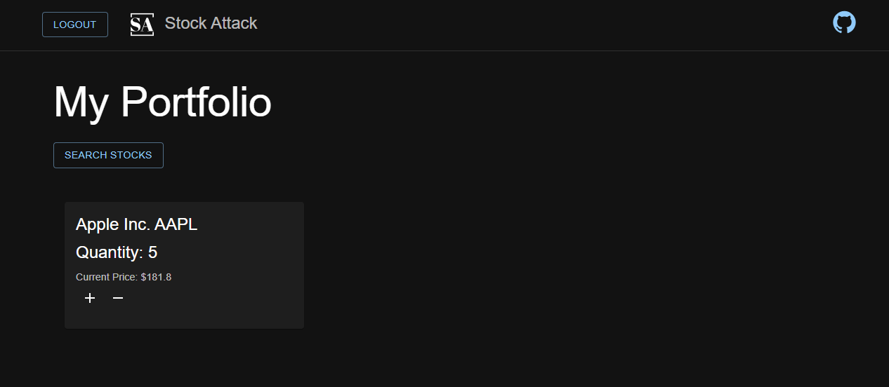
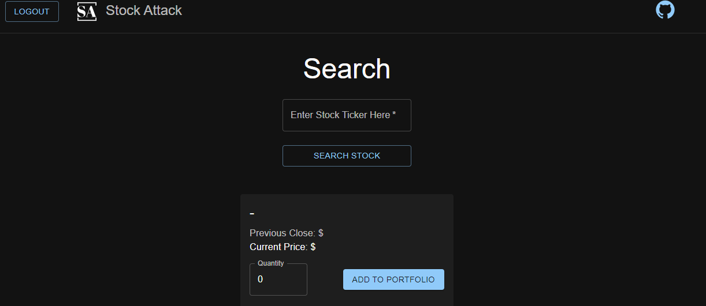

# Stock Attack

Welcome to Stock Attack, a web application that allows you to search for and track stock information for companies of your choice. Users can register an account to access their personalized homepage, where they can add stocks they are interested in and track their current prices along with previous closing prices. Here's how to get started:

## Features

User Registration: Users can register an account to access their personalized homepage.
Search Functionality: Search for companies by ticker symbol to view their current and previous closing prices.
Track Stocks: Add stocks to your personalized homepage to keep track of their current prices.
Future Updates: Stay tuned for more features, including the ability to calculate the total value of stocks held and buy/sell functionality.

## Getting Started

### If you clone from this repo:
1 Clone Repository: 
Clone this repository to your local machine.
git clone <repository_url>
2 Setup Environment:
Create a .env file based on the example provided and fill in the necessary information.
3 Install Dependencies: Install project dependencies.
npm install
4 Build Application: Build the application.
npm run build
5 Run Application: Start the development server.
npm run dev
6 Access Application:
Open your browser and navigate to http://localhost:3000 to access the application.

## web app link
https://stock-attack.onrender.com/

## pics for App
  
  

## Feedback and Contact
We welcome any feedback or suggestions you may have. Feel free to reach out to us at 
wuhongbo@gmail.com with any questions or comments.

Thank you for using Stock Attack! Happy investing! 🚀📈